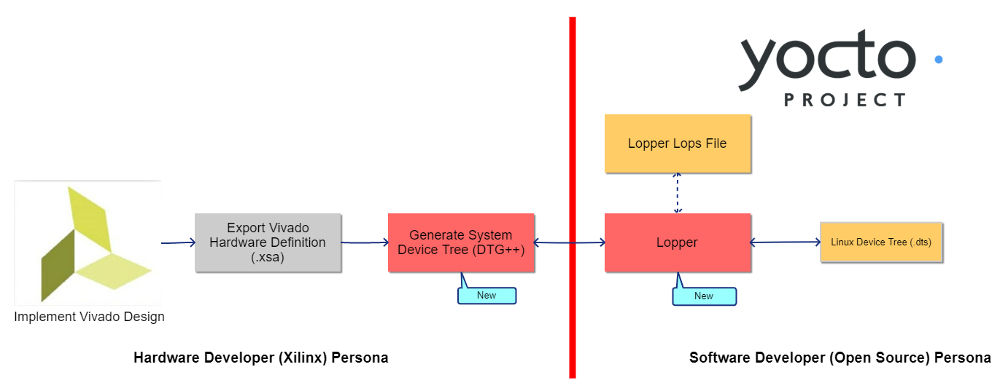

# decoupled-workflow-docs
This repository contains documentation for how to use the **technology preview** of the decoupled hardware-software handoff workflow for Xilinx SoC and ACAP device families.  The workflows documented in this repository are intended solely as a working snapshot-in-time of *potential* next-gen Xilinx embedded software design workflows and do not necessarily represent the final implementation.  This preview release is unsupported by Xilinx field resources and Worldwide Technical Support.  Use at your own risk.

# Hardware-Software Handoff Workflow Background

For many fixed SoC platforms the hand-off between hardware design teams and software design teams is either transparent or irrelevant.  This is an artifact of the fixed nature of those platforms.  That is, there is generally little to no information that needs to be communicated from the hardware design team to the software design team in order for software to be properly configured to run on the target.  Even for platforms that utilize technologies such as multiplexed IO pins the required information is simply documented in the device datasheet.  A software developer can hand-craft a devicetree (or devicetree overlays) for the target device and the devicetree will be stable in perpetuity because the silicon is fixed.

The Xilinx SoC and ACAP design workflows differ from those of other platforms in one fundamental way: they are infinitely redefinable by the customer via the device's programmable logic.   Specifically, the architecture of the entire SoC, including available IP blocks; memory offsets; clock & interrupt connections; and connectivity to IO pins is customizable and unknown until after the EDA portion of the design process is complete.  Additionally, the EDA portion of the design can iterate rapidly - sometimes multiple times per day.  Thus, hand-crafting a devicetree file for each revision of a design is not a feasible solution.

While Xilinx provides automation around tasks such as devicetree generation, the Xilinx hardware and software developer personas have historically been deeply intertwined as seen in Figure 1.  For example, in order to generate a Linux devicetree a designer was required to do one of the following:

* use the Xilinx PetaLinux tooling (this captures the design into the PetaLinux development environment)
* open the hardware design in the Xilinx SDK/Vitis environment to generate devicetree and firmware before continuing on to other build systems such as Yocto Project

|  |
| :----------------------------------------------------------: |
| Figure 1: The Classic Xilinx Hardware-Software Handoff Workflow |

In addition, this workflow puts a requirement on the software development team to

1) Track and manage revisions of the Xilinx hardware handoff file (eg, .xsa).  This may not be desirable for various reasons such as reproducability and interoperability

2) Install and integrate Xilinx tooling (eg, XSDK or Vitis).  Many software development teams cannot have vendor-specific tooling included as part of their process.  

Many open source-focused software teams cannot integrate with these requirements because they conflict with their open source methodology.  This can include  licensing reasons or even  general workflow integration reasons.  In short, it is important for the hardware-focused EDA team to hand over only what is directly relevant to the software team.

# Decoupled Workflow Project Goals

This project aims to reimagine the workflow to reflect the differentiated reality of hardware and software development workflow for our customers.

The goals of the workflow decoupling project are simple:

+ Provide a clear and natural hand-off point in the design workflow between hardware-focused EDA engineers and software-focused engineers (especially those using open source-based workflows)
+ Allow software developers and build system maintainers to implement software infrastructure without the need for installing any proprietary Xilinx tooling

# Decoupled Workflow Components
The decoupled hardware-software handoff workflow is illustrated in Figure 2.  While the decoupled  workflow is superficially similar to the classic workflow, several new tools and steps make the decoupled workflow more robust and flexible for software developers.  One of the most subtle but important distinctions between the classic workflow and the decoupled workflow is the move of devicetree generation upstream into the Vivado EDA environment.  This single change alone makes it possible for downstream developers to have the information they need about the system without using Xilinx proprietary tooling.
||
| :----------------------------------------------------------: |
|Figure 2: The Decoupled Hardware-Software Handoff Workflow|

#### Next Generation Devicetree Generator (DTG++) / System Devicetree (S-DT)

The first component of the decoupled workflow is the next-gen devicetree generator known as DTG++.  DTG++ moves the devicetree generation process upstream into Vivado.  In addition, DTG++ generates a System Devicetree (S-DT) compatible the System Devicetree generated by DTG++ is a superset of a traditional Linux-compatible devicetree. 

An overview of System Devicetree can be found on the Linaro site [here](https://static.linaro.org/connect/lvc20/presentations/LVC20-314-0.pdf).   System devicetree is architected to be compatible with traditional devicetree files and acts as a superset extension of the original syntax.

In general, System devicetree represents the entirety of the system, including components not historically relevant to an operating system.  For example, System devicetree can carry information about the CPU cluster and memory associated with the Cortex-R CPU cluster in a device such as Zynq UltraScale+ MPSoC.  While this information isn't needed for Linux to operate properly it can be used in the context of the Lopper tool (see below) to allow complex inter-software architectures to be specified in simple configuration files.

From a user perspective, the DTG++ tool is run from the Xilinx Vivado Tcl environment by the hardware design persona to generate a System devicetree (`.sdt`) file which is then provided to the software design persona.

#### Lopper

The second component of the decoupled workflow is the Lopper tool.  Lopper is a tongue-in-cheek reference to the common [gardening tool](https://duckduckgo.com/?q=lopper+garden+tool&t=hy&va=g&iax=images&ia=images) of the same name.  The purpose of Lopper is to consume the System devicetree, understand its context, and produce devicetree (or equivalent) for various software domains such as operating systems (eg, Linux), RTOS's, or bare-metal code applications.

By default, with no other inputs, Lopper will produce a Linux-compatible devicetree.

#### Lopper System Definition (YAML) Files

An optional input file to the Lopper tool (in additional to a System Devicetree) is a YAML-based system definition file.  This file can provide instructions to Lopper as to how the domain-specific devicetree files should be structured to support either OS-specific constructs or higher-level system interaction such as OpenAMP-based multiprocessing and virtualization-based mapping (eg, Xen Hypervisor passthrough & assignment).

#### Yocto Build Infrastructure

The Xilinx Yocto Project manifests repository includes a branch which includes support for the decoupled workflow entitled **2021-experimental-dt-support**.  The Yocto build infrastructure is the core of the technical preview and all of the software build steps depend on it.

# Decoupled Workflow Steps

The steps below outline the general decoupled workflow process:

1) [Prerequisites for the Decoupled Workflow](workflow-prereqs.md)
2) [Generate System Devicetree file in Vivado](generate-system-devicetree.md)
3) [Set up Yocto Project build infrastructure](yocto-build.md)
   * note that this step includes system device tree processing via Lopper
4) [Build software components from the `embeddedsw` repository](embeddedsw-build.md)

# Scope and Limitations

The current version of the preview release has the following scope limitations:

**Supported in Current Release:**

- The current preview release is only for Zynq UltraScale+ MPSoC and Versal ACAP
- The current preview release only support Xilinx Vivado 2021.1 and later releases
- Zynq UltraScale+ MPSoC support for booting Linux on both hardware and QEMU
- Versal ACAP support for booting Linux on hardware
- Support for a subset of components from the Xilinx [embeddedsw](https://github.com/Xilinx/embeddedsw) repository (see here for complete list)
- Cortex-R5 CPU0 is supported on Xilinx Zynq UltraScale+ MPSoC and Versal ACAP platforms

**Future Roadmap:**

- Support for Xen Hypervisor (including guest resource assignment)
- Support for defining OpenAMP domains
- Support for all application and driver examples in the Xilinx [embeddedsw](https://github.com/Xilinx/embeddedsw) repository
- Extend Arm Cortex-R5 support to include CPU1
- Support for subsystem and isolation definitions

# Asking Questions & Contributing

This workflow is currently in a **<u>PREVIEW</u>** state and is not officially supported by standard Xilinx technical support channels (applications engineers, forums, or worldwide technical support).  If you have questions for feedback, please direct them to the Xilinx Yocto mailing list at https://lists.yoctoproject.org/listinfo/meta-xilinx.

