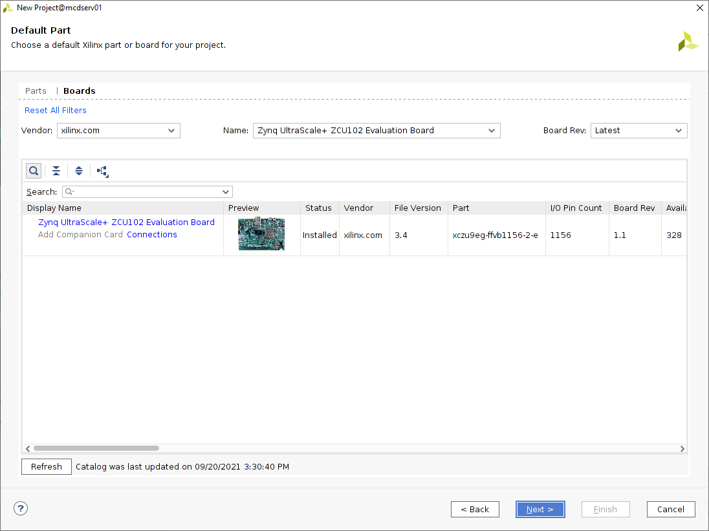
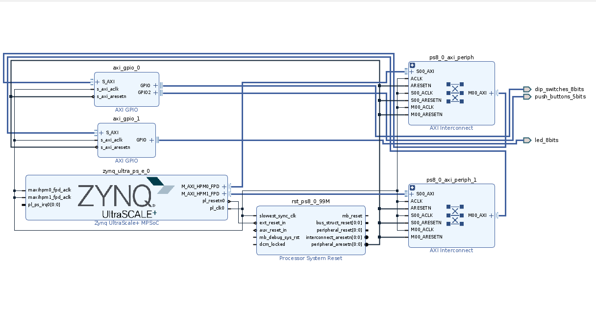
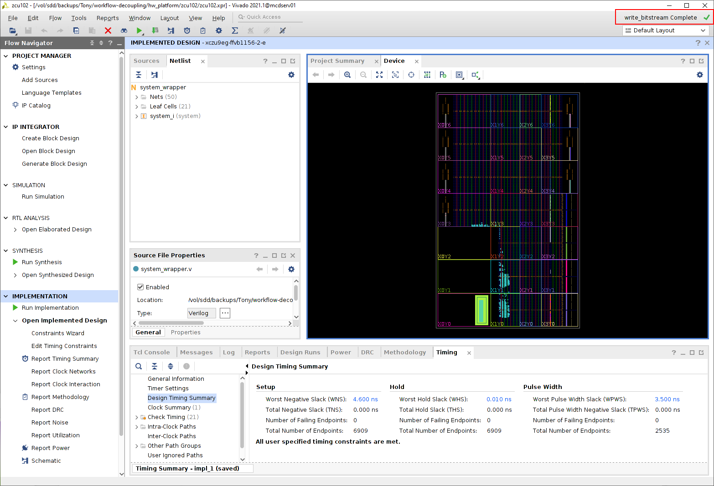
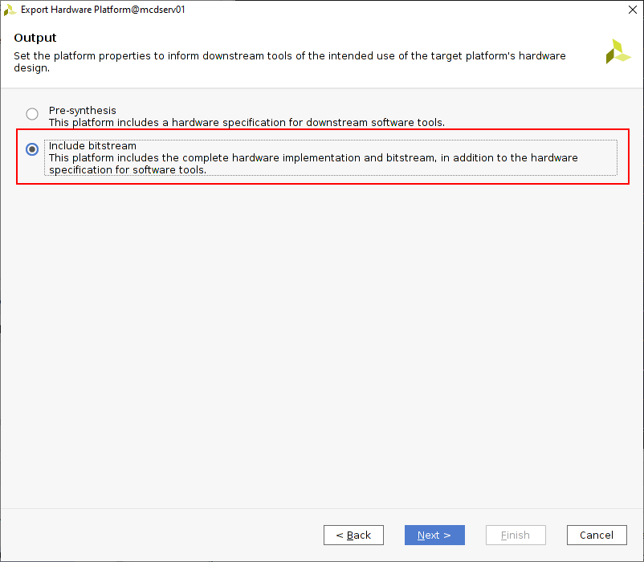
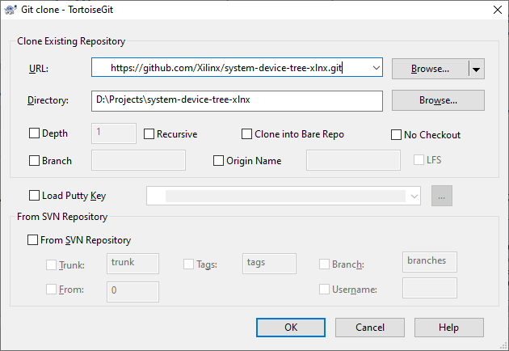
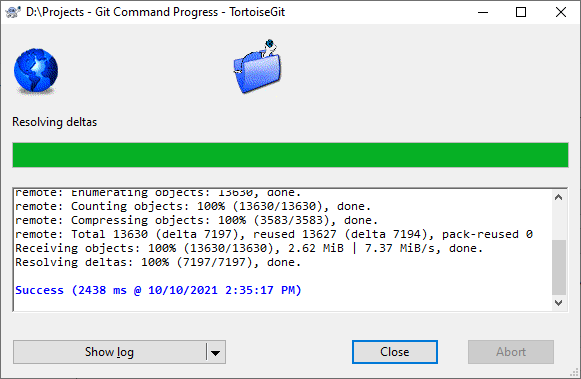

# Building the Vivado Hardware Design

The first step in the decoupled workflow process is the generation of the system devicetree file.  This is the only step that must be completed in the Vivado EDA environment.  If you work in a segregated environment, please share these instructions with your EDA engineer(s).  This is also the only step which is directly dependent upon having Xilinx EDA tooling installed.

The tool which generates the system devicetree file is called DTG++.  It is published on the Xilinx GitHub at [https://github.com/Xilinx/system-device-tree-xlnx.git](https://github.com/Xilinx/system-device-tree-xlnx.git). 

# Generate a Vivado Design

Before you can generate a system devicetree file, you must have a complete Vivado design, including generation of the hardware handoff (.xsa) file.  This is required because the DTG++ tool consumes the .xsa file.

This example focuses on generation of collateral for a the ZCU102 Evaluation Board (Zynq UltraScale+ MPSoC device) but references are provided where applicable for generation of components for Versal ACAP devices.

Start by creating a project targeting the ZCU102 board as shown in the picture.



In this example, a simple Vivado IP Integrator design is used with a collection of IO easily accessible on the ZCU102 Evaluation Board.  Any design using IP from the Vivado IP catalog should be sufficient.

**note: DTG++ does not currently recognize third-party or custom IP**



If you would like to follow along with this example, the high-resolution PDF and Vivado block diagram Tcl files are provided:

* [Vivado IPI Canvas PDF]
* [Vivado IPI Block Diagram Recreation Tcl file] - see Xilinx [Answer Record 55692](https://support.xilinx.com/s/article/55692) for information on saving and reading BD Tcl files.

When implementing the design, be sure to complete the **Write Bitstream** step.



After completing implementation of the Vivado design, export the design to a hardware handoff file (.xsa) using **File --> Export --> Export Hardware...** in the Vivado pull-down menus.

When exporting, you will be given the option of how to create .xsa file.  Be sure to include the bitstream (or device image for Versal ACAP devices) in the .xsa file as shown.



Note where the .xsa hardware handoff file is stored as it will be needed for generating the system devicetree file via DTG++.

# Fetch the DTG++ Source Code

The final task required from the hardware design persona is the creation of the system devicetree using the DTG++ tool.  Start by fetching the DTG++ source code.  This may require an additional host system tool (eg, git) on the hardware persona machine.  If the hardware persona is doing their design work on a Linux-based host please see the [Workflow Prerequisites](workflow-prereqs.md) page.  If the hardware persona is working on a Windows-based development machine they can use a tool such as [TortoiseGit](https://tortoisegit.org/) to clone the DTG++ source code.

For Linux-based EDA hosts, fetch the DTG++ source code as follows:

```
$ git clone https://github.com/Xilinx/system-device-tree-xlnx.git
$ cd system-device-tree-xlnx
```

The screenshots below shows fetching the DTG++ source code on a Windows-based host using TortoiseGit.






# Configure DTG++

The steps below assume that Vivado was closed after implementing the design because Vivado is re-launched into the console-only Tcl mode.  The same steps can be completed from an already running Vivado session so long as the implemented design is closed before continuing.

If you intend to launch Vivado in Tcl mode do so with the following command at the Linux terminal

```
$ vivado -mode tcl
```

Once in the Vivado environment, start the S-DT generation process by sourcing the DTG++ Tcl script from the repository that was cloned:

```
Vivado% source -notrace device_tree/data/device_tree.tcl
```

This bring the DTG++ tool into the Vivado Tcl environment.  The first command to use is the `set_dt_param` command.  This command has several options that are required.  The details of these options can be found by executing the Tcl help in the Vivado terminal.

```
Vivado% set_dt_param -help
```

Of particular interest (and required) are:

* `--dir` - the directory where the system devicetree file will be generated
* `--xsa` - the path to the Vivado hardware handoff (.xsa) file

Some arguments carry default values even if not specified:

* `--repo` - The path to the DTG++ (`device_tree.tcl`) source code.  The default is the current working directory.
* `--board_dts` - An optional reference to a known board DTS file.  The default value is "none"
  * Zynq UltraScale+ MPSoC example: `zcu102-rev1.0`
  * Versal ACAP example: `versal-vck190-reva`
* `--debug` - Enable or disable debug mode. The default value is "disabled".  Set to "enable" to enable.
* `--trace` -  Enable or disable DTG++ execution tracing for additional debug.  The default value is "disabled". Set to "enable" to enable.

The `set_dt_param` command can be used to set all of the parameters at one time

```
Vivado% set_dt_param --board_dts <board file> --dir <directory name> --xsa <Vivado XSA file>
```

or it can be used sequentially to set each parameter individually. This can be useful in programmatic execution.

```
Vivado% set_dt_param --dir output_dts
Vivado% set_dt_param --xsa design_1_wrapper.xsa
Vivado% set_dt_param --board_dts zcu102-rev1.0
```

Conversely, the current values of each parameter can be retrieved using the `get_dt_param` command in the same manner as the `set_dt_param` command.

# Generate the System Devicetree (S-DT) File

Once all of the parameters are set properly, the system devicetree file can be generated using the `generate_sdt` command.  This process will generate a number of files in different locations as summarized below:

For Zynq UltraScale+ MPSoC devices, DTG++ will generate the following files in the same directory as the hardware handoff (.xsa) file:

* `psu_init.tcl`
* `psu_init.html` (The Zynq UltraScale+ configuration in HTML viewable form)
* `psu_init.c`
* `psu_init.h`
* `psu_init_gpl.c`
* `psu_init_gpl.h`
* `system_wrapper.bit`

For Versal ACAP devices, DTG++ will generate the following files in the same directory as the hardware handoff (.xsa) file:

* `<export_file_name>.pdi`

For both device families, these additional files will be needed during the Yocto Project build but me specified manually in the `conf/local.conf` file of the Yocto Project workspace.

In addition, the DTG++ tool will generate the system devicetree files in the path specified in the `--dir` parameter:

**Zynq UltraScale+ MPSoC**

* `system-top.dts` - This is the top-level devicetree file which includes fundamental system information such as the number of processors present, the memory map, and memory offsets for key peripherals.  All others are referenced using the `#include` directive
* `zynqmp.dtsi` - This is the Zynq UltraScale+ architecture-specific devicetree file which includes information specific to that device family implementation
* `zynqmp-clk-ccf.dtsi` - This devicetree file includes all of the clock tree information for the system
* `pcw.dtsi` - This devicetree file includes the configuration information for all peripherals located in the Zynq UltraScale+ Processing System and specified as part of the PCW IP in Vivado
* `pl.dtsi` - This devicetree file includes the configuration information for all peripherals located in the Zynq UltraScale+ Programmable Logic

**Versal ACAP**

* `system-top.dts` - This is the top-level devicetree file which includes fundamental system information such as the number of processors present, the memory map, and memory offsets for key peripherals.  All others are referenced using the `#include` directive
* `versal.dtsi` - This is the Versal architecture-specific devicetree file which includes information specific to that device family implementation
* `versal-clk.dtsi` - This devicetree file includes all of the clock tree information for the system
* `versal-spp-pm.dtsi` - This devicetree file includes power and clock domain declarations which are needed when separating the design into domain-specific devicetree files
* `pcw.dtsi` - This devicetree file includes the configuration information for all peripherals located in the Versal Processing System and specified as part of the CIPS IP in Vivado
* `pl.dtsi` - This devicetree file includes the configuration information for all peripherals located in the Versal Programmable Logic

Additionally, devicetree binding information will be located in the `include` sub-directory various peripherals found in the design.

The hardware developer persona must share all of the contents of the path specified in the `--dir` parameter with the software developer persona.

# Notes & Exceptions

The files generated in the same directory as the hardware handoff (`.xsa`) file are still needed for use by the software developer persona.  These files (eg, `psu_init.c`, `psu_init.h`, `<export_file_name>.pdi`, etc) should be included in the set of files shared from the hardware developer persona to the software developer persona.

