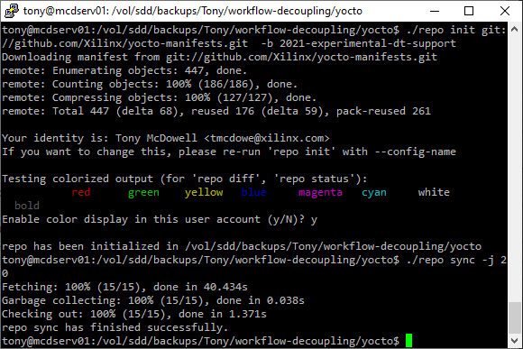

# Yocto Project Build Infrastructure

The majority of the decoupled workflow tasks inside the software developer persona are automated via the Yocto Project build environment.  While it is possible to run all of the commands - such as `lopper` -manually they are currently only documented in the context of a Yocto Project build workflow.

# Setting Up the System Devicetree

Before proceeding be sure to place the system devicetree files provided by the hardware developer persona in a location accessible by the user which will be running the Yocto builds.

For Versal ACAP users, all of the required data should already be located in the system devicetree directory.  Zynq UltraScale+ MPSoC designs require the `psu_init` files (`psu_init.h` and `psu_init.c`) to be manually copied into the same directory as `system-top.dts`.

# Configure the Yocto Project Manifests

The Yocto Project configuration uses the Repo tool to download and configure the Yocto Project environment.  Xilinx provides extensive notes on using the Repo tool with Xilinx repositories on the [Xilinx Wiki](https://xilinx-wiki.atlassian.net/wiki/spaces/A/pages/18841862/Install+and+Build+with+Xilinx+Yocto).  Also note that while the Yocto manifests are fetched from the standard Xilinx GitHub area, they are located inside the `2021-experimental-dt-support` branch.  The instructions for using repo are written [here](https://github.com/Xilinx/yocto-manifests/tree/2021-experimental-dt-support) but summarized below for brevity.

```
$ mkdir workspace
$ cd workspace
$ curl https://storage.googleapis.com/git-repo-downloads/repo > repo
$ chmod a+x repo
$ ./repo init git://github.com/Xilinx/yocto-manifests.git  -b 2021-experimental-dt-support
$ ./repo sync
$ ./repo start 2021-experimental-dt-support --all
```



# Initialize the Yocto SDK Environment

The next step is to set up the Yocto Project's SDK environment to work with the Xilinx Yocto/OpenEmbedded tooling.  This also has extensive documentation on the [Xilinx Wiki](https://xilinx-wiki.atlassian.net/wiki/spaces/A/pages/18842224/Getting+started+with+Yocto+Xilinx+layer).  Xilinx also has information about the various Yocto meta-layers and their interactions on the [Xilinx Wiki](https://xilinx-wiki.atlassian.net/wiki/spaces/A/pages/18841883/Yocto). The Xilinx manifests provide the Xilinx `setupsdk` command which automates setting up the build environment.  

```
#source the setupsdk command
$ . ./setupsdk build
```
Note that after completion, the `setupsdk` will move the current directory to `build`.  The following series of commands should be run from there rather than the workspace root.

Next, the `meta-xilinx-setup` layer should be executed with the `bitbake` command.  This command is run with the `MACHINE` prefix corresponding to the machine type which should be configured.  A complete set of valid machines can be found in `/sources/meta-xilinx/meta-xilinx-bsp/conf/machine/` but a quick summary of common ones is provided below.

|   MACHINE Name   | Board Name                                                   |
| :--------------: | ------------------------------------------------------------ |
| `zynqmp-generic` | Generic Zynq UltraScale+ MPSoC support for customer designs  |
| `zcu102-zynqmp`  | Board-specific configuration for the Xilinx ZCU102 Evaluation Board |
| `ultra96-zynqmp` | Board-specific configuration for the Avnet Ultra96 Evaluation Board |
| `versal-generic` | Generic Versal ACAP support for customer designs             |
| `vck190-versal`  | Board-specific configuration for the Xilinx VCK190 Evaluation Board |
| `vmk180-versal`  | Board-specific configuration for the Xilinx VMK180 Evaluation Board |


```
#configure the Xilinx environment with meta-xilinx-setup
$ MACHINE=zcu102-zynqmp bitbake meta-xilinx-setup
```
The `meta-xilinx-setup` step can take quite a while and requires a lot of space in `$TMPDIR`.  It is important to make sure that `$TMPDIR` is located in space that is local (such as `/tmp`) , especially if the workspace directory is on network-attached storage.

After executing `meta-xilinx-setup` the next step is to extract and install the SDK. The `-d` argument allows you to specify the sub-directory where the SDK will be installed.  In the example above it is put in the `prestep` sub-directory.

```
#install the SDK into the system
$ ./tmp/deploy/sdk/x86_64-xilinx-nativesdk-prestep-2021.2.sh -d prestep -y
```

Before proceeding, the Yocto `conf/local.conf` file must be modified to work properly with the Xilinx build environment.  Please consult the `<workspace>/prestep/README-setup` file for the most up-to-date details and modify the `conf/local.conf` file appropriately.  In general, a summary of the changes appear below:

```
# Add to the end of conf/local.conf:
include conf/distro/include/yocto-uninative.inc
INHERIT += "uninative"

# Instruct the system to use the decoupling firmware sources,
PREFERRED_VERSION_fsbl-firmware = "experimental%"
PREFERRED_VERSION_pmu-firmware = "experimental%"
PREFERRED_VERSION_plm-firmware = "experimental%"
PREFERRED_VERSION_psm-firmware = "experimental%"
```

**NOTE: these settings will likely change as the decoupled workflow matures.  Double-check this file for updated instructions when running new builds**

# Processing the System Devicetree Files

Once the Yocto Project build environment is set up it is time to integrate the system devicetree files which were part of the hand-off from the hardware developer person to the software developer persona.

First, ensure that the Yocto environment is configured.

```
$ . <yocto-build-directory>/prestep/environment-setup-x86_64-petalinux-linux
```

Next, run the devicetree processor script located inside the `prestep` area.  This calls Lopper under the hood to process the system devicetree file.

```
$ <yocto-build-directory>/prestep/dt-processor.sh <path-to-yocto-conf> <path-to-system-top.dts>
```

This command will consume the configuration data located at `<path_to_conf>`.  This is the path to the directory which contains `local.conf`.  The command also needs a full path (including filename) to the location of the system devicetree file (`system-top.dts`) which was passed from the hardware developer persona.

**NOTE: the --help option incorrectly states that the second argument is a binary .dtb file**

During the device tree processing, bare-metal components will be analyzed and appropriate `.conf` files for them will be generated and placed in the project's `/conf/` directory.

# Configuring the `local.conf` for Bare-Metal Components

Xilinx SoC and ACAP devices include several pieces of bare-metal firmware.  To enable building this as part of the standard build process. add the following to end of the `conf/local.conf` file.  Note that some paths (such as `SYSTEM_DTFILE`) may need to be adjusted to reflect the actual paths on your system.

**Zynq UltraScale+ MPSoC**

```
# Adjust BASE_TMPDIR if you want to move the tmpdirs elsewhere
BASE_TMPDIR = "${TOPDIR}"
require conf/cortexa53-zynqmp-linux.conf
SYSTEM_DTFILE = "/proj/yocto/zcu_sdt/system-top.dts"
BBMULTICONFIG += " cortexa53-zynqmp-fsbl-baremetal cortexa53-zynqmp-baremetal cortexa53-zynqmp-freertos cortexr5-zynqmp-fsbl-baremetal cortexr5-zynqmp-baremetal cortexr5-zynqmp-freertos microblaze-pmu"
FSBL_DEPENDS = ""
FSBL_MCDEPENDS = "mc::cortexa53-zynqmp-fsbl-baremetal:fsbl-firmware:do_deploy"
FSBL_DEPLOY_DIR = "${BASE_TMPDIR}/tmp-cortexa53-zynqmp-fsbl-baremetal/deploy/images/${MACHINE}"
R5FSBL_DEPENDS = ""
R5FSBL_MCDEPENDS = "mc::cortexr5-zynqmp-fsbl-baremetal:fsbl-firmware:do_deploy"
R5FSBL_DEPLOY_DIR = "${BASE_TMPDIR}/tmp-cortexr5-zynqmp-fsbl-baremetal/deploy/images/${MACHINE}"
PMU_DEPENDS = ""
PMU_MCDEPENDS = "mc::microblaze-pmu:pmu-firmware:do_deploy"
PMU_FIRMWARE_DEPLOY_DIR = "${BASE_TMPDIR}/tmp-microblaze-pmu/deploy/images/${MACHINE}"
```

**Versal ACAP:**

```
# Adjust BASE_TMPDIR if you want to move the tmpdirs elsewhere
BASE_TMPDIR = "${TOPDIR}"
require conf/cortexa72-versal-linux.conf
SYSTEM_DTFILE = "/proj/yocto/vck190-sdt/system-top.dts"
BBMULTICONFIG += " cortexa72-versal-baremetal cortexa72-versal-freertos microblaze-pmc microblaze-psm cortexr5-versal-baremetal cortexr5-versal-freertos"
PLM_DEPENDS = ""
PLM_MCDEPENDS = "mc::microblaze-pmc:plm-firmware:do_deploy"
PLM_DEPLOY_DIR = "${BASE_TMPDIR}/tmp-microblaze-pmc/deploy/images/${MACHINE}"
PSM_DEPENDS = ""
PSM_MCDEPENDS = "mc::microblaze-psm:psm-firmware:do_deploy"
PSM_FIRMWARE_DEPLOY_DIR = "${BASE_TMPDIR}/tmp-microblaze-psm/deploy/images/${MACHINE}"
PDI_PATH = "__PATH TO PDI FILE HERE__"

# NOTE: On versal, you MUST specify the PDI file as directed by the instructions.
# such as: PDI_PATH = "__PATH TO PDI FILE HERE__"
# Use the full path to the corresponding PDI file, such as:
PDI_PATH = "/proj/yocto/vck190-sdt/base-design.pdi"

```

**NOTE: when compiling for Versal ACAP platforms, the path full path to the PDI must be specified**

# Completing the Build

Once all of the configuration data is set up in `local.conf` you can run a `bitbake` build like normal.

```
$ bitbake petalinux-image-minimal
```

After the build completes, the final files will be located in `build/tmp/deploy/images/zynqmp-generic` within whatever your workspace area is (seen as `workspace` in this example).

The list of deliverables is as follows

Zynq UltraScale+ MPSoC

1) `pmufw.elf`

2) `fsbl-zynqmp-generic.elf`

3) `u-boot.elf` 

4) `arm-trusted-firmware.elf`

5) `Image`

6) `devicetree/cortexa53-zynqmp-linux.dtb`

7) `petalinux-image-minimal-zynqmp-generic.cpio.gz.u-boot`

**Versal ACAP**

1) `BOOT-versal-generic.bin`

2) `Image` 

3) `devicetree/cortexa72-versal-linux.dtb` 

4) `petalinux-image-minimal-versal-generic.cpio.gz.u-boot`

# Building the Bootable Image (`BOOT.BIN`)

If you would like to include the generation of the bootable image in the standard `bitbake` process, specify the `BIF_FILE_PATH` variable inside the `conf/local.conf` file.  The `.BIF` file syntax is documented in [UG1283 - Bootgen User Guide](https://www.xilinx.com/support/documentation/sw_manuals/xilinx2021_1/ug1283-bootgen-user-guide.pdf) and must be provided manually.  Then, `bitbake` can be run directly with the following command:

```
$ MACHINE=<generic-machine> bitbake xilinx-bootbin
```
